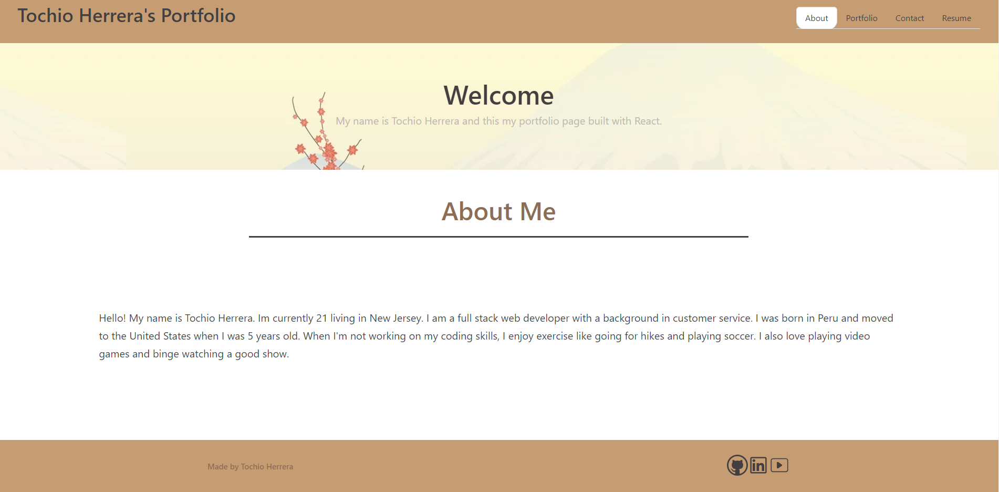

# Tochio's Portfolio

## Description 

My portfolio created with React.

## Table of Contents

- [Installation](#installation)
- [Usage](#usage)
- [Links](#links)
- [Screenshots](#screenshots)
- [License](#license)
- [Questions](#questions)

## Installation

No installation required

## Usage

Go to the site, and click on the different sections to view my information.

## Links
[Site](https://tochio12.github.io/tochio-portfolio/)

## Screenshots

## License

This application is covered under the [MIT License](https://choosealicense.com/licenses/mit) license.

## Questions

Should you have any questions, please [email](tochio12910@gmai.com) me and reach out to me on my [Github Profile](https://github.com/Tochio12)
*
*
*
*

